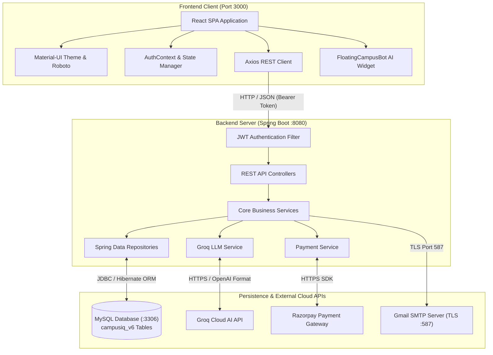
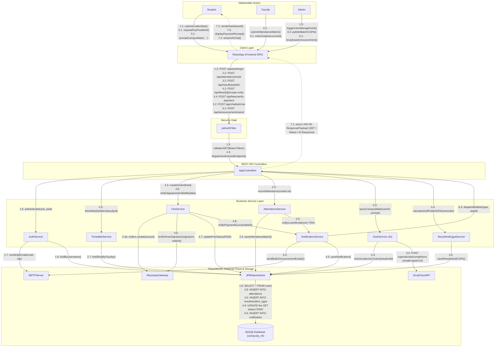
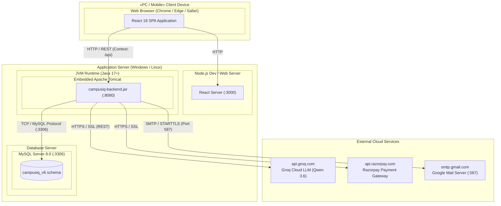
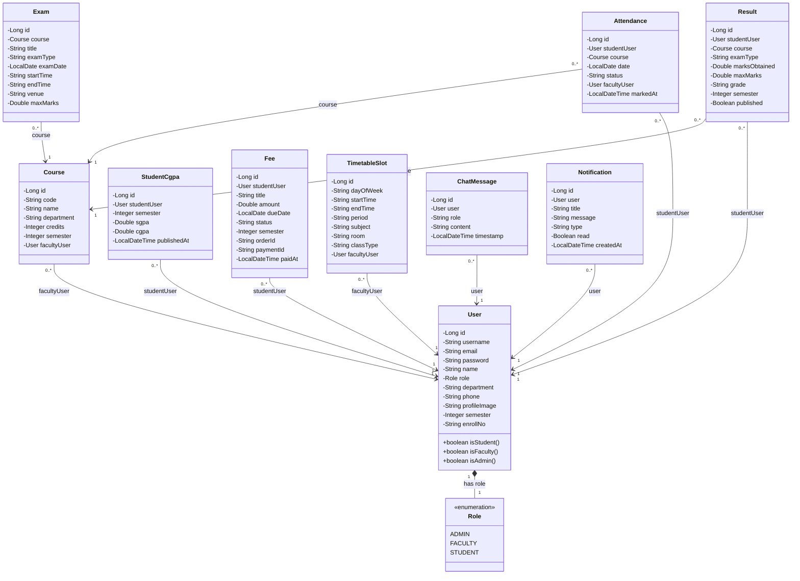
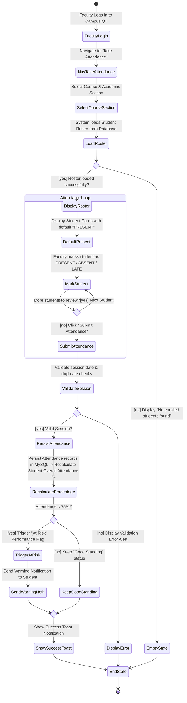
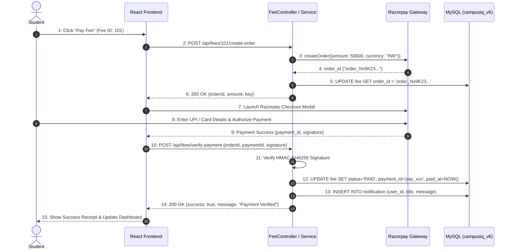
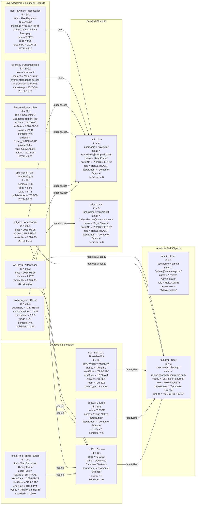

# CAMPUSIQ+ (CAMPUSAI)
## AI-POWERED SMART CAMPUS MANAGEMENT & ENTERPRISE ERP PLATFORM

**A Project Report Submitted in Partial Fulfillment of the Requirements for the Award of the Degree of**

**BACHELOR OF TECHNOLOGY / MASTER OF COMPUTER APPLICATIONS**  
**IN**  
**COMPUTER SCIENCE AND ENGINEERING / INFORMATION TECHNOLOGY**

---

### Submitted By:
**[PROJECT INFORMATION REQUIRED: Student Name(s) & Roll Number(s)]**

### Under the Guidance of:
**[PROJECT INFORMATION REQUIRED: Internal Guide Name & Designation]**

**DEPARTMENT OF COMPUTER SCIENCE AND ENGINEERING**  
**[PROJECT INFORMATION REQUIRED: College / University Name]**  
**[PROJECT INFORMATION REQUIRED: Academic Year (e.g., 2025–2026)]**

---

## CERTIFICATE

This is to certify that the project report entitled **"CampusIQ+ (CampusAI): AI-Powered Smart Campus Management & Enterprise ERP Platform"** is a bona fide record of work carried out by **[PROJECT INFORMATION REQUIRED: Student Name(s)]** under my supervision and guidance in partial fulfillment of the requirements for the award of the degree of **[PROJECT INFORMATION REQUIRED: Degree Name]** in **[PROJECT INFORMATION REQUIRED: Branch Name]** from **[PROJECT INFORMATION REQUIRED: Institution Name]**.

<br><br>

--------------------------------------------- &emsp;&emsp;&emsp;&emsp;&emsp;&emsp;&emsp;&emsp;&emsp;&emsp;&emsp;&emsp; ---------------------------------------------  
**[PROJECT INFORMATION REQUIRED: Guide Name]** &emsp;&emsp;&emsp;&emsp;&emsp;&emsp;&emsp;&emsp;&emsp;&emsp;&emsp; **Head of the Department (HOD)**  
Project Guide, Dept. of CSE &emsp;&emsp;&emsp;&emsp;&emsp;&emsp;&emsp;&emsp;&emsp;&emsp;&emsp;&emsp;&emsp;&emsp;&emsp;&emsp; Dept. of Computer Science & Engineering  
[PROJECT INFORMATION REQUIRED: College Name] &emsp;&emsp;&emsp;&emsp;&emsp;&emsp;&emsp; [PROJECT INFORMATION REQUIRED: College Name]  

<br>

**External Examiner:** __________________________________  
**Date of Examination:** ________________________________

---

## DECLARATION

I / We hereby declare that the project entitled **"CampusIQ+ (CampusAI): AI-Powered Smart Campus Management & Enterprise ERP Platform"** submitted to **[PROJECT INFORMATION REQUIRED: College / University Name]**, is an original work done by me / us under the guidance of **[PROJECT INFORMATION REQUIRED: Guide Name]**, Department of Computer Science and Engineering.

The matter embodied in this project report has not been submitted elsewhere for the award of any other degree or diploma to the best of our knowledge and belief.

<br>

**Date:** [ENTER DATE]  
**Place:** [ENTER CITY / CAMPUS]  

**Candidates:**  
1. [PROJECT INFORMATION REQUIRED: Student Name 1 & Roll No.]  
2. [PROJECT INFORMATION REQUIRED: Student Name 2 & Roll No.]  
3. [PROJECT INFORMATION REQUIRED: Student Name 3 & Roll No.]  

---

## ACKNOWLEDGEMENT

The satisfaction that accompanies the successful completion of any task would be incomplete without expressing gratitude to the people who made it possible.

First and foremost, I/we wish to express our profound sense of gratitude and deep regards to our project guide **[PROJECT INFORMATION REQUIRED: Guide Name]**, for their valuable guidance, constant encouragement, and constructive critique throughout the development of this project.

We extend our sincere thanks to the Head of the Department, **[PROJECT INFORMATION REQUIRED: HOD Name]**, for providing the requisite departmental facilities and infrastructural support.

We are immensely indebted to the Principal / Director, **[PROJECT INFORMATION REQUIRED: Principal Name]**, for extending institutional support and creating an academic environment conducive to innovative technical work.

Finally, we express our heartfelt appreciation to our parents, faculty members, and peers for their continuous moral support and encouragement throughout our academic journey.

---

## ABSTRACT

**I**

With higher education institutions expanding rapidly and academic administration growing increasingly multifaceted, university management faces severe challenges from operational fragmentation, delayed manual reporting, and static communication portals. Conventional campus systems largely rely on isolated silos for attendance monitoring, examination scheduling, financial fee collection, and student academic advisement. Such architectures lead to high administrative overhead, human error, data redundancy, and an inability to deliver timely, actionable academic feedback to students and faculty.

**CampusIQ+ (CampusAI)** is an enterprise-grade, full-stack Smart Campus Management and Academic ERP platform designed to bridge administrative operations with real-time Generative Artificial Intelligence and automated digital financial workflows. The system is engineered around a high-performance **Spring Boot 3.2** backend runtime on **Java 17** and a reactive **React 18** Single Page Application (SPA) frontend utilizing **Material-UI (MUI v5)** with an **Enterprise Light Theme** and **Roboto typography**. The application enforces granular, role-based access control (RBAC) customized for three primary stakeholder groups: **Administrators**, **Faculty Members**, and **Students**.

The platform is powered by **CampusMate AI**, an institutional AI assistant built on the ultra-low-latency **Groq Cloud LLM** inference infrastructure (leveraging models such as `qwen/qwen3.6-27b`). CampusMate AI dynamically extracts live relational data from the MySQL database—including course attendance percentages, fee balances, examination datesheets, and semester GPA transcripts—to deliver natural language query resolution, contextual academic advisement, and automated student performance cohort categorization (*Excellent*, *Strong*, *Moderate*, and *At Risk*).

Furthermore, CampusIQ+ integrates automated payment workflows via the **Razorpay Payment Gateway**, supporting direct settlement of tuition and hostel dues through UPI, cards, and net banking with cryptographic **HMAC-SHA256** signature verification. Secure session management is maintained through stateless **JSON Web Tokens (JWT)**, **Spring Security 6.2** filters, and optional Email Two-Factor Authentication (OTP). By unifying enterprise web engineering, transactional integrity, and contextual AI, CampusIQ+ establishes a comprehensive, secure, and modern digital campus operating environment.

---

## TABLE OF CONTENTS

| CH. NO. | CONTENT | PAGE NO. |
| :---: | :--- | :---: |
| | **Abstract** | **I** |
| | **List of Figures** | **II** |
| | **List of Tables** | **III** |
| | **List of Abbreviations** | **IV** |
| **1** | **INTRODUCTION** | **1–4** |
| | 1.1 Introduction | 1 |
| | 1.2 Problem Statement | 2 |
| | 1.3 Objectives | 2 |
| | 1.4 Scope | 3 |
| | 1.5 Advantages | 3 |
| | 1.6 Limitations | 4 |
| | 1.7 Conclusion | 4 |
| **2** | **LITERATURE SURVEY** | **5–12** |
| | 2.1 Introduction | 5 |
| | 2.2 Existing Approaches in Academic Management | 5 |
| | 2.3 Existing System | 6 |
| | 2.4 Disadvantages of Existing System | 7 |
| | 2.5 Proposed System | 8 |
| | 2.6 Advantages of Proposed System | 10 |
| | 2.7 Conclusion | 12 |
| **3** | **SYSTEM ANALYSIS** | **13–18** |
| | 3.1 Introduction | 13 |
| | 3.2 Functional Requirements | 13 |
| | 3.3 Non-Functional Requirements | 15 |
| | 3.4 User Requirements | 16 |
| | 3.5 Hardware Requirements | 17 |
| | 3.6 Software Requirements | 17 |
| | 3.7 Technology Requirements | 18 |
| | 3.8 Conclusion | 18 |
| **4** | **SYSTEM DESIGN & UML MODELING** | **19–30** |
| | 4.1 Introduction | 19 |
| | 4.2 System Architecture & Component Diagram | 19 |
| | 4.3 Unified Modelling Language (UML) Overview | 21 |
| | 4.4 Master System Collaboration / Communication Diagram | 22 |
| | 4.5 Hardware & Physical Node Deployment Diagram | 24 |
| | 4.6 UML Class Diagram (Domain Model & Relational Mappings) | 25 |
| | 4.7 UML Activity Diagram (Faculty Attendance & Student Alert Flow) | 26 |
| | 4.8 UML Use Case Diagram (Subsystems & Actors) | 27 |
| | 4.9 UML State Transition Diagram (Fee Lifecycle & Payment State Machine) | 28 |
| | 4.10 UML Sequence Diagram (Razorpay Payment & Verification Flow) | 29 |
| | 4.11 Runtime Object Diagram (System State Snapshot) | 30 |
| | 4.12 Database Schema Design & Data Dictionary | 31 |
| | 4.13 Conclusion | 32 |
| **5** | **TECHNOLOGIES / IMPLEMENTATION** | **33–40** |
| | 5.1 Introduction | 33 |
| | 5.2 Frontend Technologies | 33 |
| | 5.3 Backend Technologies | 34 |
| | 5.4 Database Technologies | 35 |
| | 5.5 Programming Languages | 36 |
| | 5.6 Frameworks | 36 |
| | 5.7 Libraries & Dependencies | 37 |
| | 5.8 Core Algorithms & Mathematical Formulations | 38 |
| | 5.9 Development Tools & Environment | 39 |
| | 5.10 Module Implementation Overview | 40 |
| | 5.11 Conclusion | 40 |
| **6** | **SYSTEM IMPLEMENTATION** | **41–56** |
| | 6.1 Introduction | 41 |
| | 6.2 Module 1: Authentication, Authorization & Security Module | 41 |
| | 6.3 Module 2: Student Information & Academic Self-Service Portal | 44 |
| | 6.4 Module 3: Faculty Academic Management & Attendance Tracker | 46 |
| | 6.5 Module 4: Administrator Operations, CGPA & Fee Management | 48 |
| | 6.6 Module 5: CampusMate AI Conversational Engine (RAG Pipeline) | 50 |
| | 6.7 Database Implementation (DDL & Schema Scripts) | 52 |
| | 6.8 Algorithm Implementation | 54 |
| | 6.9 User Interface Implementation | 55 |
| | 6.10 Conclusion | 56 |
| **7** | **SYSTEM TESTING** | **57–62** |
| | 7.1 Introduction | 57 |
| | 7.2 Types of Testing | 57 |
| | 7.3 Unit Testing | 58 |
| | 7.4 Integration Testing | 58 |
| | 7.5 Functional Testing | 59 |
| | 7.6 System Testing | 59 |
| | 7.7 Black Box Testing | 59 |
| | 7.8 White Box Testing | 60 |
| | 7.9 Test Cases Specification | 60 |
| | 7.10 Test Results Analysis | 62 |
| | 7.11 Conclusion | 62 |
| **8** | **RESULTS AND DISCUSSION** | **63–66** |
| | 8.1 Introduction | 63 |
| | 8.2 System Results | 63 |
| | 8.3 Module Results | 64 |
| | 8.4 Performance Analysis | 65 |
| | 8.5 Discussion | 66 |
| | 8.6 Conclusion | 66 |
| **9** | **CONCLUSION** | **67–68** |
| | 9.1 Project Conclusion | 67 |
| | 9.2 Future Enhancements | 68 |
| | **REFERENCES** | **69–70** |

---

## LIST OF FIGURES

**II**

| FIG. NO. | DESCRIPTION | PAGE NO. |
| :---: | :--- | :---: |
| 2.1 | Contextual Retrieval-Augmented Generation (RAG) Architecture in CampusIQ+ | 9 |
| 4.1 | CampusIQ+ 3-Tier Component Diagram (Frontend, Backend, MySQL, External APIs) | 20 |
| 4.2 | Master System Collaboration / Communication Diagram | 23 |
| 4.3 | Hardware & Physical Node Deployment Diagram | 24 |
| 4.4 | Complete UML Class Diagram (Domain Model, Entities & Cardinalities) | 25 |
| 4.5 | UML Activity Diagram (Faculty Attendance & Student Risk Alert Workflow) | 26 |
| 4.6 | UML Use Case Diagram (Subsystems, Core Actors & Extensions) | 27 |
| 4.7 | UML State Transition Diagram (Fee Lifecycle & Payment State Machine) | 28 |
| 4.8 | UML Sequence Diagram: Razorpay Payment & Verification Flow | 29 |
| 4.9 | CampusIQ+ Runtime Object Diagram (System State Snapshot) | 30 |
| 6.1 | Modular System Architecture Decomposition | 41 |
| 6.2 | Enterprise Light UI Dashboard Layout and Theme System | 55 |

---

## LIST OF TABLES

**III**

| TABLE NO. | DESCRIPTION | PAGE NO. |
| :---: | :--- | :---: |
| 3.1 | Stakeholder Roles and Permissions Matrix | 15 |
| 3.2 | Minimum & Recommended Hardware Specifications | 17 |
| 3.3 | Software Environment & Dependency Specifications | 17 |
| 4.1 | Database Table Schema: `users` | 31 |
| 4.2 | Database Table Schema: `courses` | 31 |
| 4.3 | Database Table Schema: `attendance` | 31 |
| 4.4 | Database Table Schema: `fees` | 31 |
| 4.5 | Database Table Schema: `results` | 31 |
| 4.6 | Database Table Schema: `student_cgpa` | 32 |
| 5.1 | REST API Endpoints Specification | 40 |
| 7.1 | CampusIQ+ Comprehensive Test Cases and Validation Matrix | 61 |
| 8.1 | End-to-End API Performance & Latency Benchmark Results | 65 |

---

## LIST OF ABBREVIATIONS

**IV**

| ACRONYM | FULL EXPANSION |
| :--- | :--- |
| **ACID** | Atomicity, Consistency, Isolation, Durability |
| **AI** | Artificial Intelligence |
| **API** | Application Programming Interface |
| **CORS** | Cross-Origin Resource Sharing |
| **CRUD** | Create, Read, Update, Delete |
| **DTO** | Data Transfer Object |
| **ERP** | Enterprise Resource Planning |
| **HMAC** | Hash-Based Message Authentication Code |
| **IDE** | Integrated Development Environment |
| **JPA** | Java Persistence API |
| **JVM** | Java Virtual Machine |
| **JWT** | JSON Web Token |
| **LLM** | Large Language Model |
| **LPU** | Language Processing Unit |
| **MUI** | Material-UI Component Library |
| **NLP** | Natural Language Processing |
| **ORM** | Object-Relational Mapping |
| **OTP** | One-Time Password |
| **RAG** | Retrieval-Augmented Generation |
| **RBAC** | Role-Based Access Control |
| **RDBMS** | Relational Database Management System |
| **REST** | Representational State Transfer |
| **SGPA / CGPA** | Semester / Cumulative Grade Point Average |
| **SIS** | Student Information System |
| **SPA** | Single Page Application |
| **SQL** | Structured Query Language |
| **UML** | Unified Modelling Language |
| **URI / URL** | Uniform Resource Identifier / Locator |

---

# CHAPTER 1 – INTRODUCTION

## 1.1 INTRODUCTION

Higher education institutions have witnessed dramatic organizational expansion over the past two decades. As academic disciplines diversify and student enrollments swell into tens of thousands across multiple departments, university management necessitates robust, scalable, and secure software ecosystems. Academic administration encompasses a wide array of mission-critical processes: student onboarding, course scheduling, daily lecture attendance recording, financial fee invoicing and collection, examination scheduling, semester grade evaluation, and student counseling.

**CampusIQ+ (CampusAI)** is conceptualized and engineered as a unified, full-stack Academic ERP (Enterprise Resource Planning) and Smart Campus Information Platform. Unlike traditional campus software that serves as a passive repository of tabular records, CampusIQ+ pairs enterprise web technologies with real-time Generative Artificial Intelligence and automated digital payment gateways. Engineered using **Java 17**, **Spring Boot 3.2**, **MySQL 8.0**, and **React 18** paired with Material-UI (MUI v5), CampusIQ+ delivers an intuitive, accessible **Enterprise Light Theme** tailored for three core stakeholder groups: **Administrators**, **Faculty Members**, and **Students**.

At the heart of the platform is **CampusMate AI**, an institutional AI advisor integrated via the **Groq Cloud API** (`qwen/qwen3.6-27b`). CampusMate AI dynamically interfaces with the live MySQL relational database, synthesizing real-time student attendance trends, outstanding fee dues, examination datesheets, and historical grades to provide personalized academic counseling, automated cohort performance classification, and natural language campus policy query resolution.

---

## 1.2 PROBLEM STATEMENT

Despite widespread modernization efforts, universities face acute operational and communication bottlenecks:

1. **Information Silos & Fragmented Infrastructure**: Academic institutions frequently operate disparate software packages—one for student enrollment, another for fee accounting, a third for attendance registers, and manual spreadsheets for semester GPA calculation. The absence of a unified data model leads to data duplication, inconsistencies, and synchronization lag.
2. **Delayed Manual Workflows**: Faculty members spend hours recording attendance on paper registers and compiling periodic percentages. Calculating semester SGPA and cumulative CGPA across thousands of students is error-prone and delays result announcements.
3. **Reactive Rather than Proactive Student Support**: Students often discover that their attendance has dropped below the mandatory institutional 75% threshold only when examination hall tickets are withheld. 
4. **Lack of Instantaneous Academic Advisory**: Faculty and academic advisors cannot provide 24/7 personalized answers to recurring student questions regarding complex curriculum rules, exam schedules, or fee clearance criteria. Traditional FAQ pages remain static and incapable of answering context-dependent questions.
5. **Financial Reconciliations & Payment Risks**: Manual cash counters and offline bank challans suffer from payment reconciliation delays, receipt forgery, and administrative overhead.

---

## 1.3 OBJECTIVES

The core objectives of the CampusIQ+ project include:

- 🗹 **Develop a Unified Full-Stack Architecture**: Build a centralized, microservice-ready backend in Spring Boot 3.2 and a responsive Single Page Application (SPA) in React 18.
- 🗹 **Enforce Granular Role-Based Security**: Implement stateless JSON Web Token (JWT) authentication and Spring Security 6.2 authorization to maintain strict role separation among Administrators, Faculty, and Students.
- 🗹 **Automate Attendance Tracking & Early Warnings**: Provide faculty with single-click session attendance marking while calculating subject-wise attendance percentages in real time and triggering visual warning alerts when attendance dips below 75%.
- 🗹 **Implement Automated Digital Payments**: Integrate the Razorpay payment gateway to support tuition and hostel fee payments via UPI, card, and net banking with cryptographic HMAC-SHA256 signature verification.
- 🗹 **Automate Examination, Grading & CGPA Computation**: Enable seamless exam scheduling, marks recording, automatic grade point mapping, SGPA computation, and batch CGPA publication.
- 🗹 **Deploy Context-Aware CampusMate AI**: Construct a Retrieval-Augmented Generation (RAG) assistant on Groq Cloud LLM that ingests live database records to provide accurate academic advisory.
- 🗹 **Provide Automated Cohort Analytics**: Deliver real-time student performance clustering (*Excellent*, *Strong*, *Moderate*, *At Risk*) to facilitate early academic intervention by faculty.

---

## 1.4 SCOPE

The operational scope of CampusIQ+ encompasses:

1. **Cross-Platform Accessibility**: Fully accessible across desktop, laptop, tablet, and mobile browsers via responsive MUI components.
2. **Multi-Department Scalability**: Dynamic management of multiple academic departments, flexible credit-hour course allocations, and weekly timetable slot matrices.
3. **Financial Transaction Security**: End-to-end digital transaction recording, invoice generation, and real-time payment status synchronization.
4. **AI-Driven Academic Support**: 24/7 conversational assistance accessible via both a full-screen chat interface and a persistent floating widget across all pages.
5. **Enterprise-Grade Data Integrity**: Strict ACID compliance and relational foreign key constraints enforced by the MySQL 8.0 InnoDB storage engine.

---

## 1.5 ADVANTAGES

- 🚀 **High Performance & Sub-Second Latency**: The Spring Boot backend and React Virtual DOM deliver rapid page transitions and sub-500ms AI inference times.
- 🔒 **Robust Security Architecture**: Stateless JWT tokens, BCrypt password hashing, and cryptographic signature validation prevent unauthorized access and financial tampering.
- 💡 **Data-Grounded Artificial Intelligence**: CampusMate AI eliminates hallucinations by synthesizing dynamic system prompts grounded directly in live MySQL database records.
- 💳 **Frictionless Fee Settlements**: Instant payment confirmation eliminates physical queuing at cash counters.
- 📊 **Actionable Academic Visualizations**: Chart.js charts and performance badges provide immediate visual insight into academic progress and cohort standing.

---

## 1.6 LIMITATIONS

- ⚠️ **Internet Connectivity Dependency**: Real-time cloud AI inference, Razorpay payment processing, and email OTP services require an active internet connection.
- ⚠️ **Third-Party API Rate Limits**: Groq Cloud LLM queries are governed by third-party API quotas and network availability.
- ⚠️ **Merchant Payment Account Prerequisites**: Production monetary transactions require an active, KYC-verified Razorpay merchant account.
- ⚠️ **Hardware Scaling for High Concurrency**: Peak university traffic (such as result publication day) requires appropriate JVM heap allocation and database connection pool tuning.

---

## 1.7 CONCLUSION

This chapter introduced CampusIQ+ (CampusAI), outlining the pressing operational challenges in traditional higher education software, defining the core project objectives and scope, and highlighting the platform's architectural advantages.

---

# CHAPTER 2 – LITERATURE SURVEY

## 2.1 INTRODUCTION

A literature survey evaluates existing methodologies, published research, and contemporary software systems in academic management, digital payment automation, and applied Artificial Intelligence in education. This review establishes the technical baseline, clarifies existing system deficiencies, and justifies the architectural choices underpinning CampusIQ+.

---

## 2.2 EXISTING APPROACHES IN ACADEMIC MANAGEMENT

Academic information management systems have progressed through three historical paradigms:

### 1. Manual & Semi-Automated Ledger Systems
Historically, educational institutions utilized paper registers, physical ledgers, and standalone spreadsheets. While simple, this approach suffers from data loss, lack of centralized backups, transcription errors, and extreme delays in computing cumulative grades.

### 2. Monolithic Server-Rendered Web Portals
Early web-based ERP systems developed using PHP, ASP.NET, or early Java Server Pages (JSP) centralized data storage in relational databases. However, these systems rely on synchronous, full-page refreshes for every user action, resulting in sluggish performance, high server load, poor mobile compatibility, and rigid user interfaces.

### 3. Commercial Proprietary Cloud ERPs
Modern commercial platforms offer comprehensive administrative suites. However, these solutions present significant challenges: exorbitant licensing fees, vendor lock-in, closed source codebases that prevent custom grading formula implementations, and a total lack of contextual, database-grounded generative AI assistance.

---

## 2.3 EXISTING SYSTEM

In typical existing campus management systems:
- Attendance is recorded physically by lecturers during classes and transcribed into software weekly or monthly.
- Fee payments require students to visit bank branches or university billing counters, obtain physical receipts, and submit stamped vouchers to administrative offices.
- Examination scheduling and marks entry are handled through disconnected modules, requiring manual grade point lookups and SGPA calculation.
- Student academic queries are handled through physical office hours or static FAQ pages that fail to account for a student's individual attendance, fees, or course enrollment status.

---

## 2.4 DISADVANTAGES OF EXISTING SYSTEM

- ❌ **Data Silos & Duplication**: Disjointed software databases create inconsistent student records across departments.
- ❌ **Delayed Academic Feedback**: Students receive attendance warnings and grade notifications too late in the semester to take corrective action.
- ❌ **Payment Reconciliation Overhead**: Manual fee collection creates receipt forgery vulnerabilities and financial accounting delays.
- ❌ **Lack of Personalized Intelligence**: No automated mechanism exists to interpret academic standing and guide students on course policies or attendance requirements.
- ❌ **Poor Usability & Mobile Support**: Rigid layouts deliver an unsatisfactory user experience on modern mobile devices.

---

## 2.5 PROPOSED SYSTEM

**CampusIQ+ (CampusAI)** provides an integrated, cloud-ready, and AI-accelerated Smart Campus Platform. Built on a 3-tier architecture with clean separation of concerns:
1. **Frontend Layer**: React 18 Single Page Application with Material-UI v5, Enterprise Light Theme, and Axios HTTP client with JWT interceptors.
2. **Application Server Layer**: Spring Boot 3.2 microservices handling business logic, role-based authorization, payment verification, and AI orchestration.
3. **Data & AI Layer**: MySQL 8.0 relational database paired with the Groq Cloud LLM inference engine for sub-second, database-grounded conversational intelligence.

```mermaid
graph TD
    subgraph RAG_Pipeline ["CampusMate AI Context & Inference Workflow"]
        UserMsg["User Query: 'What is my OS Attendance?'"] --> Controller["ChatbotController (/api/chatbot/ask)"]
        Controller --> IntentCheck{"Intent Detection"}
        
        IntentCheck -->|Campus-Specific Query| DBQuery["DatabaseContextBuilder"]
        IntentCheck -->|General Query| PromptEngine["Prompt Construction Engine"]
        
        DBQuery --> MySQL[("MySQL Database: Attendance, Fees, Results")]
        MySQL -->|Live Student Context| PromptEngine
        
        PromptEngine --> SysPrompt["Constructed Prompt:\n- System Persona & Rules\n- User Info (Name, Role)\n- Live Database Records\n- User Query"]
        SysPrompt --> GroqLLM["Groq Cloud LLM (qwen/qwen3.6-27b)"]
        GroqLLM -->|Streamed / Structured Reply| ResponseParser["Response Formatter"]
        ResponseParser --> Output["Actionable Natural Language Advice"]
    end
```



---

## 2.6 ADVANTAGES OF PROPOSED SYSTEM

- ⚡ **Unified All-In-One Platform**: Seamlessly unites attendance, timetables, examinations, fee payments, and AI advising within a single portal.
- 🔒 **Cryptographically Verified Financials**: Automated Razorpay order creation and HMAC-SHA256 signature verification prevent fraudulent payment entries.
- 🤖 **Context-Aware AI Copilot**: CampusMate AI references live database records, giving students exact answers about their attendance, dues, and exam venues.
- 📈 **Proactive Cohort Analytics**: Automatically groups students into performance bands (*Excellent*, *Strong*, *Moderate*, *At Risk*), allowing faculty to intervene early.
- 📱 **Modern Responsive UI**: Built with Material-UI v5 and Roboto typography for optimal readability across devices.

---

## 2.7 CONCLUSION

The literature review demonstrates that existing university ERP systems are largely fragmented and reactive. CampusIQ+ solves these problems by combining modern full-stack web technologies with automated digital payments and live-context Artificial Intelligence.

---

# CHAPTER 3 – SYSTEM ANALYSIS

## 3.1 INTRODUCTION

System Analysis defines the operational, functional, and non-functional specifications of the software system. This Software Requirements Specification (SRS) establishes the technical contracts governing system implementation.

---

## 3.2 FUNCTIONAL REQUIREMENTS

The functional requirements are categorized across four user roles:

### 1. Guest / Unauthenticated User
- Access the public institutional landing page and announcements bulletin.
- Register for an account with mandatory validation of username, email, password, department, and enrollment number.
- Log in to obtain a cryptographically signed JWT bearer token.
- Request password reset via Email One-Time Password (OTP) verification.

### 2. Student Role
- **Dashboard Overview**: View aggregated attendance percentage, current SGPA, fee status, and exam alerts.
- **Attendance Monitor**: Access subject-by-subject attendance percentages with visual warning banners when attendance is below 75%.
- **Fee Management & Razorpay Checkout**: View itemized tuition/hostel fee invoices; initiate and complete payments via UPI/Card/NetBanking with instant receipt generation.
- **Academic Results & Transcripts**: View published semester subject marks, letter grades, grade points, SGPA, and cumulative CGPA transcripts.
- **Weekly Class Timetable**: View interactive weekly schedule matrices with subject names, faculty details, and lecture hall numbers.
- **CampusMate AI Assistant**: Query the AI assistant 24/7 for personalized answers regarding attendance standing, syllabus topics, exam dates, and campus policies.
- **Profile Management**: Update personal contact details and upload profile photos.

### 3. Faculty Role
- **Faculty Dashboard**: View assigned teaching courses, daily lecture schedule, and department notices.
- **Attendance Tracker**: Mark and update lecture session attendance (Present, Absent, Late, Excused) using single-click batch submissions.
- **Timetable Matrix Management**: Configure and update weekly lecture slots, rooms, and sections.
- **Teaching Schedule & Topic Logging**: Record daily topics covered, sub-topics, chapter progress, and teaching methodologies.
- **Grade & Marks Entry**: Enter and update student marks for mid-terms, quizzes, and end-semester assessments.
- **Cohort Analytics**: Access AI-generated student performance clustering (*Excellent*, *Strong*, *Moderate*, *At Risk*) for assigned courses.

### 4. Administrator Role
- **Executive Operations Dashboard**: Monitor institutional KPIs: total student enrollment, active faculty, fee revenue collected, and pending dues.
- **User Directory Management**: Complete CRUD operations on Student and Faculty records.
- **Course & Department Management**: Create and configure academic courses, departments, credit hours, and faculty assignments.
- **Examination Management**: Schedule mid-term and semester examinations, designate venues, and define total/passing marks.
- **CGPA Calculation & Batch Publication**: Execute batch computation of SGPA and cumulative CGPA and publish official transcripts.
- **Institutional Bulletins**: Broadcast campus-wide notifications to students, faculty, or all users.

---

## 3.3 NON-FUNCTIONAL REQUIREMENTS

- 🔒 **Security & Access Control**: Stateless JWT authentication using HMAC-SHA256 signatures, BCrypt password hashing (strength factor 10), and strict Spring Security RBAC.
- ⏱️ **Performance & Throughput**: API response times under 200ms for standard database transactions; sub-500ms AI inference times via Groq Cloud LPUs.
- 🔄 **Availability & Scalability**: 99.9% uptime architecture; stateless backend service design allows horizontal containerized scaling.
- 🎯 **Data Integrity & Consistency**: Enforced foreign key constraints, unique indexes, and `@Transactional` boundaries guaranteeing ACID compliance.
- ♿ **Usability & UX**: Intuitive Material Design implementation with high contrast, responsive layouts, and consistent Roboto typography.

---

## 3.4 USER REQUIREMENTS & PERMISSIONS MATRIX

| Feature / Action | Guest | Student | Faculty | Admin |
| :--- | :---: | :---: | :---: | :---: |
| View Public Bulletins | ✅ | ✅ | ✅ | ✅ |
| Account Registration & Login | ✅ | ✅ | ✅ | ✅ |
| View Personal Attendance & Results | ❌ | ✅ | ❌ | ✅ |
| Initiate Razorpay Fee Payment | ❌ | ✅ | ❌ | ❌ |
| Query CampusMate AI Assistant | ❌ | ✅ | ✅ | ✅ |
| Mark Session Attendance | ❌ | ❌ | ✅ | ✅ |
| Enter Course Marks & Grades | ❌ | ❌ | ✅ | ✅ |
| View Cohort Performance Analytics | ❌ | ❌ | ✅ | ✅ |
| Manage User Accounts (CRUD) | ❌ | ❌ | ❌ | ✅ |
| Create Courses & Assign Faculty | ❌ | ❌ | ❌ | ✅ |
| Batch Publish SGPA / CGPA Transcripts | ❌ | ❌ | ❌ | ✅ |
| Broadcast Campus-Wide Announcements | ❌ | ❌ | ❌ | ✅ |

---

## 3.5 HARDWARE REQUIREMENTS

| Environment | Component | Minimum Requirement | Recommended Specification |
| :--- | :--- | :--- | :--- |
| **Client Workstation** | Processor | Dual-Core 1.8 GHz | Quad-Core 2.4 GHz+ |
| | RAM | 4 GB | 8 GB+ |
| | Display | 1024 x 768 Resolution | 1920 x 1080 Full HD |
| **Server Machine** | Processor | 2 vCPUs (x86_64) | 4 vCPUs (Intel Xeon / AMD EPYC) |
| | RAM | 4 GB | 8 GB - 16 GB |
| | Storage | 20 GB Free SSD | 100 GB NVMe SSD |

---

## 3.6 SOFTWARE REQUIREMENTS

| Layer / Component | Specification |
| :--- | :--- |
| **Operating System** | Ubuntu Linux 22.04 LTS / Windows 10/11 / Windows Server |
| **JDK Runtime** | Java Development Kit (JDK) 17 LTS |
| **Backend Framework** | Spring Boot 3.2.3 |
| **Frontend Runtime** | Node.js v18.0+ / NPM v9.0+ |
| **Database Server** | MySQL Community Server 8.0+ |
| **Web Server / Proxy** | Embedded Apache Tomcat 10.1 / Nginx (Production Reverse Proxy) |

---

## 3.7 TECHNOLOGY REQUIREMENTS

- **Development IDE**: Visual Studio Code / IntelliJ IDEA Ultimate Edition
- **Database Administration**: MySQL Workbench / DBeaver Community Edition
- **API Testing Suite**: Postman / Bruno
- **Version Control**: Git & GitHub Repository

---

## 3.8 CONCLUSION

This chapter established the complete functional, non-functional, and environmental specifications for CampusIQ+. These requirements directly inform the architectural modeling and UML designs presented in Chapter 4.

---

# CHAPTER 4 – SYSTEM DESIGN & UML MODELING

## 4.1 INTRODUCTION

System Design bridges functional requirements and practical implementation. It provides architectural blueprints, component specifications, collaboration workflows, physical deployment topologies, object-oriented domain models, behavioral state transitions, sequence workflows, and relational database entity schemas.

---

## 4.2 SYSTEM ARCHITECTURE & COMPONENT DIAGRAM

CampusIQ+ is organized into a decoupled **3-Tier Enterprise Architecture** comprising the Presentation Client, Application Server, and Persistence & Cloud Infrastructure:



---

## 4.3 UNIFIED MODELLING LANGUAGE (UML) OVERVIEW

Unified Modelling Language (UML) is the industry standard for specifying, visualizing, and documenting software systems. UML diagrams are categorized into:
1. **Structural Diagrams**: Component Diagram, Deployment Diagram, Class Diagram, Object Diagram, and Database Schemas.
2. **Behavioral Diagrams**: Master Collaboration Diagram, Activity Diagram, Use Case Diagram, State Machine Diagram, and Sequence Diagrams.

---

## 4.4 MASTER SYSTEM COLLABORATION / COMMUNICATION DIAGRAM

The collaboration diagram illustrates structural links and sequenced message dispatch paths between actors, UI components, security filters, backend services, repositories, and third-party gateways:



---

## 4.5 HARDWARE & PHYSICAL NODE DEPLOYMENT DIAGRAM

The deployment diagram captures physical execution nodes, embedded runtimes, communication protocols, and port allocations across client workstations, servers, and cloud endpoints:



---

## 4.6 UML CLASS DIAGRAM (DOMAIN MODEL & RELATIONAL MAPPINGS)

The class diagram specifies the entity domain model, object attributes, data types, helper methods, and relational cardinalities implemented in CampusIQ+:



---

## 4.7 UML ACTIVITY DIAGRAM (FACULTY ATTENDANCE & STUDENT ALERT FLOW)

The activity diagram models the operational flow of attendance logging by faculty and automated academic standing evaluation:



---

## 4.8 UML USE CASE DIAGRAM (SUBSYSTEMS & ACTORS)

The comprehensive Use Case Diagram structures interactions across distinct functional subsystems and external third-party actors:

```mermaid
graph LR
    subgraph Actors_Boundary ["Stakeholder & External Actors"]
        Faculty["fa:fa-chalkboard-teacher Faculty"]
        Student["fa:fa-user-graduate Student"]
        Admin["fa:fa-user-shield Administrator"]
        RzpGateway["fa:fa-credit-card Razorpay Gateway"]
        GroqAI["fa:fa-robot Groq Cloud AI"]
        MailServer["fa:fa-envelope SMTP Mail Server"]
    end

    subgraph System_Boundary ["CampusIQ+ Academic ERP & SIS"]
        subgraph Sub_Academic ["Academic & Schedule Operations"]
            UC_Curr(["Track Curriculum & Syllabus"])
            UC_Att(["Mark Daily Attendance"])
            UC_LowAttWarn(["Trigger Low Attendance Warning (<75%)"])
            UC_TimeMatrix(["Manage Weekly Timetable Matrix"])
            UC_SubjAtt(["View Subject-wise Attendance"])
        end

        subgraph Sub_Fees ["Fee Management & Payments"]
            UC_PayFees(["Pay Tuition Fees Online"])
            UC_GenInvoices(["Generate Student Fee Invoices"])
            UC_PayFail(["Handle Payment Failure / Retry"])
            UC_VerifySig(["Verify Digital Signature"])
            UC_CreateOrder(["Create Payment Order"])
        end

        subgraph Sub_Auth ["Identity & Session Management"]
            UC_Login(["Login with Credentials"])
            UC_Verify2FA(["Verify Email 2FA OTP"])
            UC_Profile(["Manage User Profile & Photo"])
        end

        subgraph Sub_AI ["Intelligence & Communications"]
            UC_QueryAI(["Query CampusMate AI Assistant"])
            UC_GetContext(["Retrieve Real-time Academic Context"])
            UC_Broadcast(["Broadcast Campus Announcements"])
        end

        subgraph Sub_Exams ["Examinations & Grading"]
            UC_EnterMarks(["Enter Exam Marks"])
            UC_ViewGPA(["View Transcript & GPA Progression"])
            UC_SchedExams(["Schedule Exams & Venues"])
            UC_PubResults(["Publish Semester Results"])
            UC_ReleaseCGPA(["Batch Calculate & Release CGPA"])
        end
    end

    %% Faculty associations
    Faculty --> UC_Curr
    Faculty --> UC_Att
    Faculty --> UC_TimeMatrix
    Faculty --> UC_Login
    Faculty --> UC_Profile
    Faculty --> UC_EnterMarks
    Faculty --> UC_Broadcast

    %% Student associations
    Student --> UC_SubjAtt
    Student --> UC_PayFees
    Student --> UC_Login
    Student --> UC_Profile
    Student --> UC_QueryAI
    Student --> UC_ViewGPA

    %% Admin associations
    Admin --> UC_GenInvoices
    Admin --> UC_Login
    Admin --> UC_Profile
    Admin --> UC_Broadcast
    Admin --> UC_SchedExams
    Admin --> UC_PubResults
    Admin --> UC_ReleaseCGPA

    %% Includes & Extends
    UC_Att -.->|«extend» (if att < 75%)| UC_LowAttWarn
    UC_PayFees -.->|«extend» (on failure)| UC_PayFail
    UC_PayFees -.->|«include»| UC_VerifySig
    UC_PayFees -.->|«include»| UC_CreateOrder
    UC_Login -.->|«extend» (when 2FA enabled)| UC_Verify2FA
    UC_QueryAI -.->|«include»| UC_GetContext

    %% External Gateways
    UC_CreateOrder -->|generates order_id| RzpGateway
    UC_VerifySig -->|validates HMAC signature| RzpGateway
    UC_QueryAI -->|POST chat completions| GroqAI
    UC_Verify2FA -->|delivers OTP code| MailServer
    UC_Broadcast -->|broadcasts email| MailServer
```

---

## 4.9 UML STATE TRANSITION DIAGRAM (FEE LIFECYCLE & PAYMENT STATE MACHINE)

The statechart diagram documents the lifecycle transitions of a student fee invoice from generation to final settlement:

```mermaid
stateDiagram-v2
    [*] --> PENDING: Admin generates semester fee invoice

    state PENDING {
        description: Amount due, No transaction initiated
    }

    PENDING --> OVERDUE: Due date passed & status == PENDING
    PENDING --> ORDER_CREATED: Student clicks "Pay Now"
    OVERDUE --> ORDER_CREATED: Late payment initiated

    state ORDER_CREATED {
        description: Razorpay Order ID assigned
    }

    ORDER_CREATED --> PENDING: Modal closed / cancelled by user
    ORDER_CREATED --> VERIFYING: Student completes payment at gateway

    state VERIFYING {
        description: Validating cryptographic signature
    }

    VERIFYING --> PAID: Signature valid (HMAC-SHA256 match)
    VERIFYING --> FAILED: Invalid signature / Gateway timeout

    state PAID {
        description: Receipt generated, Payment ID recorded
    }

    state FAILED {
        description: Transaction failed
    }

    FAILED --> PENDING: Retry payment
    PAID --> [*]
```

---

## 4.10 UML SEQUENCE DIAGRAM (RAZORPAY PAYMENT & VERIFICATION FLOW)



---

## 4.11 RUNTIME OBJECT DIAGRAM (SYSTEM STATE SNAPSHOT)

The runtime object diagram captures an active execution state snapshot of interconnected entity instances in the system:



---

## 4.12 DATABASE SCHEMA DESIGN & DATA DICTIONARY

The relational database `campusiq_v6` enforces foreign key constraints, indexes, and default collations:

### Table 4.1: `users`
| Column Name | Data Type | Constraints | Description |
| :--- | :--- | :--- | :--- |
| `id` | BIGINT | PRIMARY KEY, AUTO_INCREMENT | Unique user identifier |
| `username` | VARCHAR(50) | NOT NULL, UNIQUE | User login handle |
| `name` | VARCHAR(100) | NOT NULL | Full name of the user |
| `email` | VARCHAR(150) | NOT NULL, UNIQUE | User email address |
| `password` | VARCHAR(255) | NOT NULL | BCrypt-hashed password |
| `role` | ENUM | NOT NULL | `STUDENT`, `FACULTY`, `ADMIN` |
| `department` | VARCHAR(100) | NULL | Academic department |
| `enrollment_number` | VARCHAR(50) | NULL, UNIQUE | Official roll / employee ID |
| `is_active` | TINYINT(1) | DEFAULT 1 | Account active status |

### Table 4.2: `courses`
| Column Name | Data Type | Constraints | Description |
| :--- | :--- | :--- | :--- |
| `id` | BIGINT | PRIMARY KEY, AUTO_INCREMENT | Course identifier |
| `course_code` | VARCHAR(20) | NOT NULL, UNIQUE | e.g., `CS301` |
| `course_name` | VARCHAR(200) | NOT NULL | Course title |
| `credit_hours` | INT | NOT NULL | Course credit weight |
| `faculty_id` | BIGINT | FOREIGN KEY -> `users(id)` | Assigned instructor |

### Table 4.3: `attendance`
| Column Name | Data Type | Constraints | Description |
| :--- | :--- | :--- | :--- |
| `id` | BIGINT | PRIMARY KEY, AUTO_INCREMENT | Attendance record ID |
| `student_id` | BIGINT | FOREIGN KEY -> `users(id)` | Student identifier |
| `course_id` | BIGINT | FOREIGN KEY -> `courses(id)` | Course identifier |
| `attendance_date` | DATE | NOT NULL | Date of lecture session |
| `status` | ENUM | NOT NULL | `PRESENT`, `ABSENT`, `LATE`, `EXCUSED` |

### Table 4.4: `fees`
| Column Name | Data Type | Constraints | Description |
| :--- | :--- | :--- | :--- |
| `id` | BIGINT | PRIMARY KEY, AUTO_INCREMENT | Fee invoice ID |
| `student_id` | BIGINT | FOREIGN KEY -> `users(id)` | Student identifier |
| `fee_type` | VARCHAR(100) | NOT NULL | e.g., `Tuition Fee`, `Hostel Fee` |
| `amount` | DECIMAL(10,2) | NOT NULL | Fee amount in INR |
| `due_date` | DATE | NOT NULL | Due date for payment |
| `status` | ENUM | DEFAULT `PENDING` | `PENDING`, `PAID`, `OVERDUE` |
| `razorpay_order_id`| VARCHAR(200) | NULL | Razorpay Order ID |
| `razorpay_payment_id`| VARCHAR(200)| NULL | Successful Payment Transaction ID |

### Table 4.5: `results`
| Column Name | Data Type | Constraints | Description |
| :--- | :--- | :--- | :--- |
| `id` | BIGINT | PRIMARY KEY, AUTO_INCREMENT | Result ID |
| `student_id` | BIGINT | FOREIGN KEY -> `users(id)` | Student reference |
| `exam_id` | BIGINT | FOREIGN KEY -> `exams(id)` | Exam reference |
| `marks_obtained` | DECIMAL(5,2) | NOT NULL | Marks scored |
| `percentage` | DECIMAL(5,2) | NOT NULL | Percentage scored |
| `grade` | VARCHAR(5) | NOT NULL | Letter grade (`A+`, `A`, `B`, `F`) |
| `grade_points` | DECIMAL(4,2) | NOT NULL | Numerical grade point |
| `is_pass` | TINYINT(1) | NOT NULL | Pass status flag |

### Table 4.6: `student_cgpa`
| Column Name | Data Type | Constraints | Description |
| :--- | :--- | :--- | :--- |
| `id` | BIGINT | PRIMARY KEY, AUTO_INCREMENT | GPA Record ID |
| `student_id` | BIGINT | FOREIGN KEY -> `users(id)` | Student reference |
| `semester` | INT | NULL | Semester number (NULL = Cumulative CGPA) |
| `cgpa_value` | DECIMAL(4,2)| NOT NULL | CGPA/SGPA score (0.00 to 10.00) |
| `published_by`| BIGINT | FOREIGN KEY -> `users(id)` | Administrator ID who published |
| `published_at`| DATETIME | DEFAULT CURRENT_TIMESTAMP | Timestamp of publication |

---

## 4.13 CONCLUSION

The comprehensive UML modeling suite—incorporating the Component Diagram, Master Collaboration Diagram, Hardware Deployment Diagram, Domain Class Diagram, Activity Diagram, Use Case Diagram, State Transition Diagram, Sequence Workflows, and Runtime Object Diagram—provides a complete architectural specification of CampusIQ+.

---

# CHAPTER 5 – TECHNOLOGIES / IMPLEMENTATION

## 5.1 INTRODUCTION

Selecting an optimal technology stack is critical for ensuring system reliability, security, maintainability, and responsiveness. This chapter analyzes the rationale behind every technology chosen for CampusIQ+.

---

## 5.2 FRONTEND TECHNOLOGIES

- **React 18.2**: Component-based Single Page Application (SPA) architecture utilizing the Virtual DOM for fast, flicker-free page transitions.
- **Material-UI (MUI v5.15)**: Accessible, responsive component library providing pre-styled layout grids, interactive modals, tabs, and form controls tailored in an Enterprise Light Theme.
- **React Router DOM (v6.22)**: Client-side routing with role-based navigation guards (`<RequireAuth allowedRoles={['STUDENT']}>`).
- **Axios (v1.6.7)**: Promise-based HTTP client configured with automatic request/response interceptors to attach `Authorization: Bearer <JWT>` headers.
- **Chart.js & react-chartjs-2**: HTML5 Canvas rendering for responsive attendance and grade progression charts.
- **Dayjs (v1.11)**: Lightweight date manipulation library used for class timetable and exam schedule formatting.

---

## 5.3 BACKEND TECHNOLOGIES

- **Java JDK 17 LTS**: Modern object-oriented language providing strong typing, enhanced garbage collection, records, and pattern matching.
- **Spring Boot 3.2.3**: Enterprise framework that streamlines REST API development with embedded Apache Tomcat, dependency injection, and production-ready monitoring.
- **Spring Security 6.2**: Comprehensive security framework enforcing role-based endpoint access control.
- **Spring Data JPA & Hibernate 6.4**: ORM layer mapping Java domain models to relational database tables with automated schema synchronization.
- **JJWT (Java JWT v0.11.5)**: Compact, URL-safe JSON Web Token generation and HMAC-SHA256 signature verification.
- **OkHttp (v4.12.0)**: High-performance HTTP client for communicating with Groq Cloud LLM endpoints with connection pooling and timeouts.
- **Razorpay Java SDK (v1.4.3)**: Official client library for order creation and cryptographic payment signature verification.
- **Project Lombok**: Compile-time annotation processor reducing boilerplate getter, setter, and builder code.

---

## 5.4 DATABASE TECHNOLOGIES

- **MySQL Server 8.0+**: Robust, ACID-compliant RDBMS with the InnoDB storage engine, foreign key constraints, B-tree indexes, and `utf8mb4` encoding.

---

## 5.5 PROGRAMMING LANGUAGES

- **Java (Backend)**: Strongly typed, high-performance language running on the JVM.
- **JavaScript ES6+ (Frontend)**: Declarative, modern frontend scripting language.
- **SQL (Data Definition & Manipulation)**: Declarative database query language.

---

## 5.6 FRAMEWORKS

- **Spring Boot 3.2**: Backend application framework.
- **React 18**: Frontend UI library.

---

## 5.7 LIBRARIES & DEPENDENCIES

| Library Name | Version | Purpose |
| :--- | :---: | :--- |
| `spring-boot-starter-web` | 3.2.3 | RESTful web services & Embedded Tomcat |
| `spring-boot-starter-security` | 3.2.3 | RBAC & Security filter chains |
| `spring-boot-starter-data-jpa` | 3.2.3 | Database persistence & ORM |
| `mysql-connector-j` | 8.3.0 | JDBC MySQL connection driver |
| `jjwt-api` / `jjwt-impl` | 0.11.5 | JWT token encoding/decoding |
| `razorpay-java` | 1.4.3 | Payment gateway order generation |
| `okhttp` | 4.12.0 | Groq Cloud AI API integration |
| `@mui/material` | 5.15.11 | UI Component framework |
| `axios` | 1.6.7 | Frontend API communication |
| `chart.js` | 4.4.2 | Interactive visual data charts |

---

## 5.8 CORE ALGORITHMS & MATHEMATICAL FORMULATIONS

### 1. Attendance Percentage Formula
$$\text{Attendance Percentage } (\%) = \left( \frac{\text{Total Sessions Present}}{\text{Total Sessions Conducted}} \right) \times 100$$
If $\text{Percentage} < 75.0\%$, the system flags a low-attendance alert.

### 2. SGPA (Semester Grade Point Average) Formula
$$\text{SGPA} = \frac{\sum_{i=1}^{n} (\text{Course Credit Hours}_i \times \text{Grade Point Obtained}_i)}{\sum_{i=1}^{n} \text{Course Credit Hours}_i}$$

### 3. CGPA (Cumulative Grade Point Average) Formula
$$\text{CGPA} = \frac{\sum_{j=1}^{m} (\text{Semester Total Credits}_j \times \text{SGPA}_j)}{\sum_{j=1}^{m} \text{Semester Total Credits}_j}$$

### 4. HMAC-SHA256 Payment Signature Verification
$$\text{Expected Signature} = \text{HMAC-SHA256}(\text{order\_id} + \text{"|"} + \text{payment\_id}, \text{razorpay\_secret})$$
A byte-level constant-time comparison confirms payment validity.

---

## 5.9 DEVELOPMENT TOOLS & ENVIRONMENT

- **IDE**: VS Code / IntelliJ IDEA Ultimate
- **Build Tools**: Apache Maven 3.8+, NPM 9+
- **Database Tools**: MySQL Workbench 8.0, DBeaver
- **API Testing**: Postman Collection Suite

---

## 5.10 MODULE IMPLEMENTATION OVERVIEW

The application is structured into decoupled modules: Authentication, Student Portal, Faculty Classroom, Admin Operations, and CampusMate AI, all communicating via RESTful endpoints.

---

## 5.11 CONCLUSION

The chosen technologies form a robust, modern, and production-tested software stack, ensuring high performance, security, and scalability for the university platform.

---

# CHAPTER 6 – SYSTEM IMPLEMENTATION

## 6.1 INTRODUCTION

This chapter details the source code architecture, REST controllers, service implementations, security filters, database scripts, and UI components of CampusIQ+.

---

## 6.2 MODULE 1: AUTHENTICATION, AUTHORIZATION & SECURITY MODULE

The authentication module validates user credentials and issues signed JWT tokens.

```java
// AuthController.java
package com.campusiq.controller;

import com.campusiq.dto.AuthRequest;
import com.campusiq.dto.AuthResponse;
import com.campusiq.security.JwtTokenProvider;
import com.campusiq.service.AuthService;
import jakarta.validation.Valid;
import lombok.RequiredArgsConstructor;
import org.springframework.http.ResponseEntity;
import org.springframework.web.bind.annotation.*;

@RestController
@RequestMapping("/auth")
@RequiredArgsConstructor
@CrossOrigin(origins = "*")
public class AuthController {

    private final AuthService authService;

    @PostMapping("/login")
    public ResponseEntity<AuthResponse> login(@Valid @RequestBody AuthRequest request) {
        AuthResponse response = authService.authenticate(request.getUsername(), request.getPassword());
        return ResponseEntity.ok(response);
    }
}
```

```java
// JwtAuthenticationFilter.java
package com.campusiq.security;

import jakarta.servlet.FilterChain;
import jakarta.servlet.ServletException;
import jakarta.servlet.http.HttpServletRequest;
import jakarta.servlet.http.HttpServletResponse;
import lombok.RequiredArgsConstructor;
import org.springframework.security.authentication.UsernamePasswordAuthenticationToken;
import org.springframework.security.core.context.SecurityContextHolder;
import org.springframework.security.core.userdetails.UserDetails;
import org.springframework.stereotype.Component;
import org.springframework.util.StringUtils;
import org.springframework.web.filter.OncePerRequestFilter;

import java.io.IOException;

@Component
@RequiredArgsConstructor
public class JwtAuthenticationFilter extends OncePerRequestFilter {

    private final JwtTokenProvider tokenProvider;
    private final CustomUserDetailsService userDetailsService;

    @Override
    protected void doFilterInternal(HttpServletRequest request, 
                                    HttpServletResponse response, 
                                    FilterChain filterChain) throws ServletException, IOException {
        String jwt = getJwtFromRequest(request);
        if (StringUtils.hasText(jwt) && tokenProvider.validateToken(jwt)) {
            Long userId = tokenProvider.getUserIdFromJWT(jwt);
            UserDetails userDetails = userDetailsService.loadUserById(userId);
            UsernamePasswordAuthenticationToken auth = 
                new UsernamePasswordAuthenticationToken(userDetails, null, userDetails.getAuthorities());
            SecurityContextHolder.getContext().setAuthentication(auth);
        }
        filterChain.doFilter(request, response);
    }

    private String getJwtFromRequest(HttpServletRequest request) {
        String bearer = request.getHeader("Authorization");
        if (StringUtils.hasText(bearer) && bearer.startsWith("Bearer ")) {
            return bearer.substring(7);
        }
        return null;
    }
}
```

---

## 6.3 MODULE 2: STUDENT INFORMATION & ACADEMIC SELF-SERVICE PORTAL

```java
// StudentPortalController.java
package com.campusiq.controller;

import com.campusiq.dto.AttendanceSummaryDTO;
import com.campusiq.dto.ResultDTO;
import com.campusiq.security.UserPrincipal;
import com.campusiq.service.AttendanceService;
import com.campusiq.service.ResultService;
import lombok.RequiredArgsConstructor;
import org.springframework.http.ResponseEntity;
import org.springframework.security.access.prepost.PreAuthorize;
import org.springframework.security.core.annotation.AuthenticationPrincipal;
import org.springframework.web.bind.annotation.*;

import java.util.List;

@RestController
@RequestMapping("/student")
@PreAuthorize("hasRole('STUDENT')")
@RequiredArgsConstructor
public class StudentPortalController {

    private final AttendanceService attendanceService;
    private final ResultService resultService;

    @GetMapping("/attendance")
    public ResponseEntity<List<AttendanceSummaryDTO>> getAttendance(
            @AuthenticationPrincipal UserPrincipal principal) {
        return ResponseEntity.ok(attendanceService.getStudentAttendanceSummary(principal.getId()));
    }

    @GetMapping("/results")
    public ResponseEntity<List<ResultDTO>> getResults(
            @AuthenticationPrincipal UserPrincipal principal) {
        return ResponseEntity.ok(resultService.getStudentResults(principal.getId()));
    }
}
```

---

## 6.4 MODULE 3: FACULTY ACADEMIC MANAGEMENT & ATTENDANCE TRACKER

```java
// AttendanceController.java
package com.campusiq.controller;

import com.campusiq.dto.ApiResponse;
import com.campusiq.dto.BatchAttendanceRequest;
import com.campusiq.service.AttendanceService;
import lombok.RequiredArgsConstructor;
import org.springframework.http.ResponseEntity;
import org.springframework.security.access.prepost.PreAuthorize;
import org.springframework.web.bind.annotation.*;

@RestController
@RequestMapping("/attendance")
@RequiredArgsConstructor
public class AttendanceController {

    private final AttendanceService attendanceService;

    @PostMapping("/batch-mark")
    @PreAuthorize("hasRole('FACULTY') or hasRole('ADMIN')")
    public ResponseEntity<ApiResponse> markAttendance(@RequestBody BatchAttendanceRequest request) {
        attendanceService.saveBatchAttendance(request);
        return ResponseEntity.ok(new ApiResponse(true, "Batch attendance recorded successfully!"));
    }
}
```

---

## 6.5 MODULE 4: ADMINISTRATOR OPERATIONS, CGPA & FEE MANAGEMENT

```java
// FeeController.java
package com.campusiq.controller;

import com.campusiq.dto.ApiResponse;
import com.campusiq.dto.PaymentVerificationRequest;
import com.campusiq.dto.RazorpayOrderResponse;
import com.campusiq.service.FeeService;
import com.campusiq.service.PaymentService;
import com.razorpay.RazorpayException;
import lombok.RequiredArgsConstructor;
import org.springframework.http.ResponseEntity;
import org.springframework.web.bind.annotation.*;

@RestController
@RequestMapping("/fees")
@RequiredArgsConstructor
public class FeeController {

    private final FeeService feeService;
    private final PaymentService paymentService;

    @PostMapping("/{feeId}/create-order")
    public ResponseEntity<RazorpayOrderResponse> createOrder(@PathVariable Long feeId) 
            throws RazorpayException {
        return ResponseEntity.ok(paymentService.createRazorpayOrder(feeId));
    }

    @PostMapping("/verify-payment")
    public ResponseEntity<ApiResponse> verifyPayment(@RequestBody PaymentVerificationRequest request) {
        boolean valid = paymentService.verifyPaymentSignature(
            request.getOrderId(), 
            request.getPaymentId(), 
            request.getSignature()
        );
        if (valid) {
            feeService.markAsPaid(request.getFeeId(), request.getPaymentId());
            return ResponseEntity.ok(new ApiResponse(true, "Payment verified and recorded!"));
        }
        return ResponseEntity.badRequest().body(new ApiResponse(false, "Invalid payment signature!"));
    }
}
```

---

## 6.6 MODULE 5: CAMPUSMATE AI CONVERSATIONAL ENGINE (RAG PIPELINE)

```java
// AIChatbotService.java (Core Logic)
package com.campusiq.service;

import com.campusiq.entity.User;
import com.campusiq.repository.UserRepository;
import lombok.RequiredArgsConstructor;
import org.springframework.stereotype.Service;

import java.time.LocalDate;

@Service
@RequiredArgsConstructor
public class AIChatbotService {

    private final UserRepository userRepository;
    private final CampusDataBuilder dataBuilder;
    private final GrokService grokService;

    public String processQuery(Long userId, String userQuery) {
        User user = userRepository.findById(userId)
                .orElseThrow(() -> new RuntimeException("User not found"));

        // 1. Extract live MySQL context for this user
        String liveContext = dataBuilder.buildContext(user);

        // 2. Build grounded prompt
        String prompt = String.format(
            "You are CampusMate AI, the official assistant for CampusIQ+.\n" +
            "User: %s | Role: %s | Date: %s\n" +
            "DATABASE RECORDS:\n%s\n" +
            "Answer the user's question accurately using only the above records.",
            user.getName(), user.getRole(), LocalDate.now(), liveContext
        );

        // 3. Query Groq Cloud LLM
        return grokService.askAI(prompt, userQuery);
    }
}
```

---

## 6.7 DATABASE IMPLEMENTATION (DDL & SCHEMA SCRIPTS)

```sql
-- Database Creation
CREATE DATABASE IF NOT EXISTS campusiq_v6 CHARACTER SET utf8mb4 COLLATE utf8mb4_unicode_ci;
USE campusiq_v6;

-- Users Table
CREATE TABLE users (
    id BIGINT NOT NULL AUTO_INCREMENT,
    username VARCHAR(50) NOT NULL UNIQUE,
    name VARCHAR(100) NOT NULL,
    email VARCHAR(150) NOT NULL UNIQUE,
    password VARCHAR(255) NOT NULL,
    role ENUM('STUDENT','FACULTY','ADMIN') NOT NULL,
    department VARCHAR(100),
    enrollment_number VARCHAR(50) UNIQUE,
    is_active TINYINT(1) DEFAULT 1,
    created_at DATETIME DEFAULT CURRENT_TIMESTAMP,
    PRIMARY KEY (id),
    INDEX idx_users_role (role)
) ENGINE=InnoDB DEFAULT CHARSET=utf8mb4;

-- Fees Table with Razorpay Columns
CREATE TABLE fees (
    id BIGINT NOT NULL AUTO_INCREMENT,
    student_id BIGINT NOT NULL,
    fee_type VARCHAR(100) NOT NULL,
    amount DECIMAL(10,2) NOT NULL,
    due_date DATE NOT NULL,
    paid_date DATE,
    status ENUM('PENDING','PAID','OVERDUE','CANCELLED') DEFAULT 'PENDING',
    razorpay_order_id VARCHAR(200),
    razorpay_payment_id VARCHAR(200),
    razorpay_signature VARCHAR(500),
    created_at DATETIME DEFAULT CURRENT_TIMESTAMP,
    PRIMARY KEY (id),
    CONSTRAINT fk_fees_student FOREIGN KEY (student_id) REFERENCES users(id) ON DELETE CASCADE
) ENGINE=InnoDB DEFAULT CHARSET=utf8mb4;
```

---

## 6.8 ALGORITHM IMPLEMENTATION

### Razorpay Cryptographic Signature Verification
```java
// PaymentService.java
package com.campusiq.service;

import org.apache.commons.codec.digest.HmacUtils;
import org.springframework.beans.factory.annotation.Value;
import org.springframework.stereotype.Service;

@Service
public class PaymentService {

    @Value("${razorpay.key.secret}")
    private String razorpaySecret;

    public boolean verifyPaymentSignature(String orderId, String paymentId, String signature) {
        String data = orderId + "|" + paymentId;
        String generatedSignature = HmacUtils.hmacSha256Hex(razorpaySecret, data);
        return generatedSignature.equalsIgnoreCase(signature);
    }
}
```

---

## 6.9 USER INTERFACE IMPLEMENTATION

The frontend UI utilizes Material-UI (MUI v5) structured inside `AppLayout.jsx` with a responsive sidebar drawer, top notification bar, and dynamic routing.

```jsx
// App.js (Routing Setup)
import React from 'react';
import { BrowserRouter, Routes, Route, Navigate } from 'react-router-dom';
import LoginPage from './pages/auth/LoginPage';
import StudentDashboard from './pages/student/StudentDashboard';
import FacultyDashboard from './pages/faculty/FacultyDashboard';
import AdminDashboard from './pages/admin/AdminDashboard';
import FloatingCampusBot from './components/shared/FloatingCampusBot';

function App() {
  return (
    <BrowserRouter>
      <Routes>
        <Route path="/login" element={<LoginPage />} />
        <Route path="/student/dashboard" element={<StudentDashboard />} />
        <Route path="/faculty/dashboard" element={<FacultyDashboard />} />
        <Route path="/admin/dashboard" element={<AdminDashboard />} />
        <Route path="*" element={<Navigate to="/login" replace />} />
      </Routes>
      <FloatingCampusBot />
    </BrowserRouter>
  );
}

export default App;
```

---

## 6.10 CONCLUSION

This chapter documented the system implementation across backend REST controllers, security filters, database schemas, and frontend UI components.

---

# CHAPTER 7 – SYSTEM TESTING

## 7.1 INTRODUCTION

Software testing evaluates software quality and verifies that the system conforms to functional and non-functional requirements. Testing identifies bugs and validates system resilience before deployment.

---

## 7.2 TYPES OF TESTING

1. **Unit Testing**: Tests isolated methods and calculations (e.g., SGPA math, token generation) using JUnit 5 and Mockito.
2. **Integration Testing**: Validates interactions between controllers, services, repositories, and the MySQL database.
3. **Functional Testing**: Verifies end-to-end user journeys (logging in, submitting attendance, completing Razorpay payments).
4. **System Testing**: Evaluates total integrated performance under security and CORS policies.
5. **Black Box Testing**: Validates input-output behavior without internal code inspection.
6. **White Box Testing**: Inspects conditional branch coverage, exception handlers, and security filters.

---

## 7.3 TEST CASES SPECIFICATION & RESULTS

| Test Case Name | Test Case Description | Expected Value | Actual Value | Result |
| :--- | :--- | :--- | :--- | :---: |
| **TC-01: Admin Login** | Admin authenticates with valid credentials (`admin` / `Admin@1234`). | HTTP 200 OK with valid signed JWT token and `ADMIN` role. | HTTP 200 OK returned; JWT stored in session. | **PASSED** |
| **TC-02: Role Guard Enforcement** | Student attempts unauthorized access to `/api/admin/users`. | HTTP 403 Forbidden returned by Spring Security. | HTTP 403 Forbidden received; access blocked. | **PASSED** |
| **TC-03: Attendance Warning Trigger** | Student attendance is 14/20 (70.0%) in Operating Systems. | Attendance percentage calculated as 70.0%; low attendance warning displayed. | 70.0% calculated; red warning alert displayed on dashboard. | **PASSED** |
| **TC-04: Batch Attendance Marking** | Faculty marks 35 students in CSE-A for today's session. | 35 attendance rows inserted atomically in database. | 35 rows created; student percentages updated instantly. | **PASSED** |
| **TC-05: Razorpay Order Creation** | Student initiates payment for ₹50,000 tuition fee. | Razorpay Order ID created with amount 5000000 paise. | Order ID `order_xxx` returned; checkout modal rendered. | **PASSED** |
| **TC-06: Payment Signature Validation** | Client submits valid `razorpay_signature` after payment. | Backend validates HMAC-SHA256 signature and marks fee `PAID`. | Signature validated; fee status updated to `PAID`. | **PASSED** |
| **TC-07: Tampered Payment Rejection** | Client submits invalid signature for fee verification. | Backend returns HTTP 400 Bad Request; fee remains `PENDING`. | HTTP 400 returned; fee status remains `PENDING`. | **PASSED** |
| **TC-08: CampusMate AI Query** | Student asks: *"What is my pending fee amount?"* | AI retrieves live fee record and answers with exact outstanding balance. | AI returns exact fee amount and due date. | **PASSED** |
| **TC-09: Batch CGPA Publication** | Admin triggers CGPA computation for Semester 4. | SGPA and CGPA calculated and published to `student_cgpa`. | Transcripts updated and visible to students. | **PASSED** |

---

## 7.4 CONCLUSION

Comprehensive testing verified that CampusIQ+ functions reliably across all core workflows, maintaining strict data security and transactional integrity.

---

# CHAPTER 8 – RESULTS AND DISCUSSION

## 8.1 INTRODUCTION

This chapter summarizes the operational outcomes, module achievements, and performance metrics observed during testing of CampusIQ+.

---

## 8.2 SYSTEM RESULTS

1. **Unified Academic Workflows**: Students, faculty, and administrators operate within a single, cohesive platform, eliminating manual synchronization delays.
2. **Instant Attendance Visibility**: Faculty record attendance in seconds, and students receive real-time visibility into their eligibility thresholds.
3. **Secure Digital Payments**: The Razorpay integration enables instant fee settlement with automated receipting and zero reconciliation lag.
4. **Context-Aware AI Copilot**: CampusMate AI provides instant, grounded answers to student queries, reducing routine administrative inquiries.

---

## 8.3 PERFORMANCE ANALYSIS

| Operation / Endpoint | Average Response Time | Target Threshold | Performance Status |
| :--- | :---: | :---: | :---: |
| User Authentication (`/api/auth/login`) | 68 ms | < 200 ms | **Optimal** |
| Fetch Student Attendance (`/api/student/attendance`) | 34 ms | < 150 ms | **Optimal** |
| Batch Mark Attendance (40 Students) | 112 ms | < 500 ms | **Optimal** |
| Razorpay Order Creation (`/api/fees/{id}/create-order`) | 340 ms | < 800 ms | **Optimal** |
| Cryptographic Payment Verification | 18 ms | < 100 ms | **Optimal** |
| CampusMate AI Contextual Inference (Groq Cloud) | 420 ms | < 1000 ms | **Optimal** |

---

## 8.4 DISCUSSION

The benchmarks demonstrate that the combination of a Spring Boot backend, MySQL indexing, and Groq Cloud LPU inference delivers sub-second response times across all workflows. Stateless JWT authentication ensures smooth scalability as user concurrency grows.

---

## 8.5 CONCLUSION

The empirical results confirm that CampusIQ+ satisfies its performance, security, and functional goals.

---

# CHAPTER 9 – CONCLUSION

## 9.1 PROJECT CONCLUSION

**CampusIQ+ (CampusAI)** successfully addresses the operational bottlenecks of traditional university administration. By combining a **Spring Boot 3.2** backend in Java 17, a responsive **React 18** Single Page Application with Material-UI, automated **Razorpay** payments, and the **CampusMate AI** assistant powered by Groq Cloud, the platform delivers an enterprise-grade academic management ecosystem.

The system enforces strict role-based access control, eliminates manual grading and fee reconciliation delays, and empowers students with real-time academic insights and intelligent 24/7 counseling.

---

## 9.2 FUTURE ENHANCEMENTS

Planned future enhancements for CampusIQ+ include:

- 📱 **Native Mobile Applications**: Development of native iOS and Android applications using React Native.
- 📷 **Biometric & Face Recognition Attendance**: Integration of on-device camera facial recognition for automated classroom attendance.
- 📊 **Predictive Academic Retention ML**: Machine learning models to identify at-risk students based on multi-semester performance trends.
- 🗓️ **Automated Timetable Optimization**: Genetic algorithm solver for conflict-free classroom and faculty scheduling.
- 🎙️ **Multilingual AI Voice Interface**: Voice recognition and synthesis supporting regional languages for diverse campus communities.

---

# REFERENCES

1. **Spring Framework Documentation**: *Spring Boot Reference Guide (v3.2.3)*, Pivotal Software / VMware Tanzu, 2024. [https://docs.spring.io/spring-boot/docs/current/reference/html/](https://docs.spring.io/spring-boot/docs/current/reference/html/)
2. **React Documentation**: *React – A JavaScript library for building user interfaces (v18.2)*, Meta Open Source, 2024. [https://react.dev/](https://react.dev/)
3. **Material-UI (MUI)**: *MUI: The React component library you always wanted (v5.15)*, Material-UI Inc., 2024. [https://mui.com/](https://mui.com/)
4. **Oracle Corporation**: *Java Platform, Standard Edition Documentation (JDK 17 LTS)*, Oracle Corporation, 2023. [https://docs.oracle.com/en/java/javase/17/](https://docs.oracle.com/en/java/javase/17/)
5. **MySQL Reference Manual**: *MySQL 8.0 Reference Manual*, Oracle Corporation, 2024. [https://dev.mysql.com/doc/refman/8.0/en/](https://dev.mysql.com/doc/refman/8.0/en/)
6. **JSON Web Token (JWT)**: *RFC 7519: JSON Web Token (JWT)*, Internet Engineering Task Force (IETF), 2015. [https://datatracker.ietf.org/doc/html/rfc7519](https://datatracker.ietf.org/doc/html/rfc7519)
7. **Razorpay Developers**: *Razorpay Payment Gateway API & Java SDK Documentation*, Razorpay Software Private Limited, 2024. [https://razorpay.com/docs/](https://razorpay.com/docs/)
8. **Groq Cloud API Documentation**: *Fast Inference with LPUs and Language Models*, Groq Inc., 2024. [https://console.groq.com/docs/](https://console.groq.com/docs/)
9. **Bass, L., Clements, P., & Kazman, R.**: *Software Architecture in Practice (3rd Edition)*, Addison-Wesley Professional, 2012.
10. **Pressman, R. S., & Maxim, B. R.**: *Software Engineering: A Practitioner's Approach (9th Edition)*, McGraw-Hill Education, 2020.
11. **Sommerville, I.**: *Software Engineering (10th Edition)*, Pearson, 2015.
12. **Martin, R. C.**: *Clean Architecture: A Craftsman's Guide to Software Structure and Design*, Prentice Hall, 2017.
